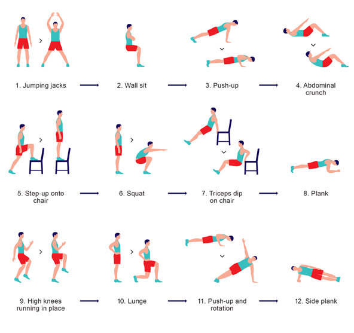

### Tabata

This is an adapted version of [Tabata](https://en.wikipedia.org/wiki/High-intensity_interval_training#Tabata_regimen)

Do each exercise for 60 seconds

- Pushups
- Squats
- Situps
- Plank
- Jumping jacks
- High knees
- Left side plank
- Right side plank

### 7 Minute Workout

- [2013 NY Times article](https://well.blogs.nytimes.com/2013/05/09/the-scientific-7-minute-workout/)

1. Jumping jacks
2. Wall sits
3. Push-ups
4. Abdominal crunches
5. Step-up onto chair
6. Squat
7. Triceps dip on chair
8. Plank
9. High knees running in place
10. Lunge
11. Push-up with rotation
12. Side plank

